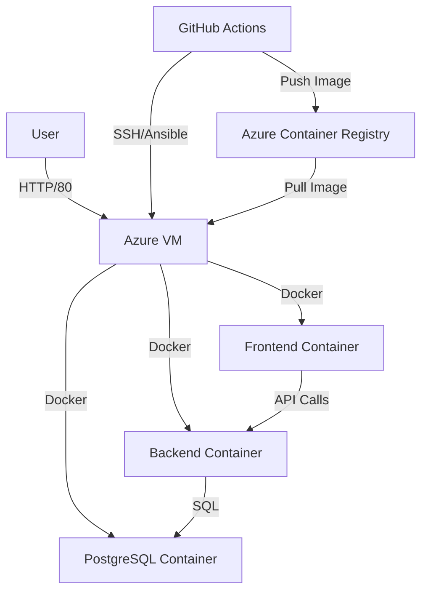

# System Architecture

## Overview
The application is a 3-tier web application deployed on Azure using Infrastructure as Code (Terraform) and Configuration Management (Ansible).

## Components

### Infrastructure (Azure)
- **Resource Group**: `devopspipeline-dev-rg`
- **Virtual Network**: `devopspipeline-dev-vnet` (10.0.0.0/16)
- **Subnet**: `devopspipeline-dev-subnet` (10.0.1.0/24)
- **Network Security Group**: `devopspipeline-dev-nsg` (Allows SSH, HTTP, HTTPS, App Port 3000)
- **Virtual Machine**: `devopspipeline-dev-vm` (Standard_B2s, Ubuntu 22.04)
- **Container Registry**: Azure Container Registry (ACR) for storing Docker images.

### Application Stack
- **Frontend**: React (Vite) running on Nginx (Port 80).
- **Backend**: Node.js (Express) API (Port 3000).
- **Database**: PostgreSQL (Containerized).

### CI/CD Pipeline
- **Source Control**: GitHub
- **CI**: GitHub Actions (Lint, Test, Security Scan, Build).
- **CD**: GitHub Actions -> Ansible -> Azure VM.
- **IaC**: Terraform Cloud.

## Diagram

